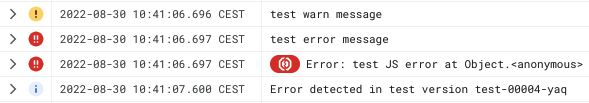

GCP logging for nodeJS
======================

Based on the idea of [mr-pascal/nestjs-gcp-logging](https://github.com/mr-pascal/nestjs-gcp-logging/) without nestjs
references.

## Motivation

Google [suggests](https://cloud.google.com/logging/docs/setup/nodejs) to use *Bunyan* or *Winston* as logging
framework for nodeJS. This module is a more lightweight approach and utilizes the *structured logging* format
via normal `stdout`, so GCP parses the log information correctly.



## Usage

```typescript
import Logger from '@philsch/gcp-logging';
import {Severity} from '@philsch/gcp-logging'; // optional: if you need additional severities

// init once (for example at the location where you init your server)
Logger.init();

// use the Logger
Logger.log("Info message");
Logger.warn("Warning message");
Logger.error("Error message");

// you can set any severity manually
Logger.log("This is an emergency", Severity.EMERGENCY);

// if you pass an Error object, a Google Cloud Error Reporting entry will be created
Logger.error(new Error("Report this in Error Reporting"));
```